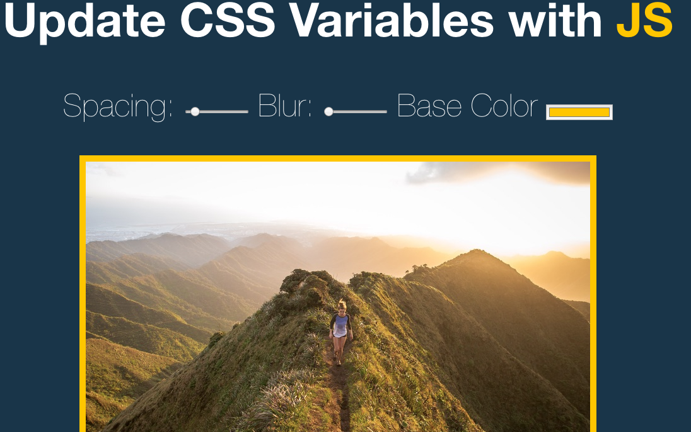

# Update CSS variables with JS

## [Check out demo!](https://mmazurkiewicz.github.io/Vanilla-JS-Drum-Kit/)

### Features:

* Changing picture frame size
* Changing picture blur
* Changing picture frame color

### Made with:
* HTML
* CSS
* Vanilla JS
* ES 6

_background downloaded from unsplash.com_

_this is a 3rd challange from JavaScript30 | https://javascript30.com/_
___

License
----

MIT
